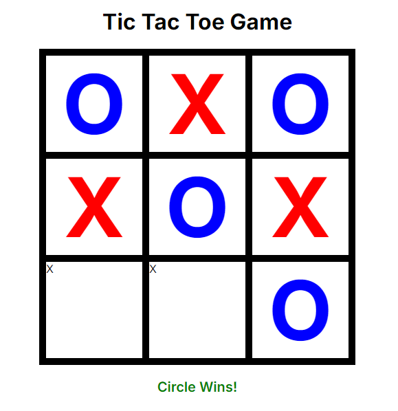

# Tic-Tac-Toe-Game

This Repo contains a simple 'Tic-Tac-Toe' game built using Next.js.

### Preview Image : 


## Installation

To get started with the project, you need to clone the repository and install the dependencies.

### 1. Clone the Repository

```bash
git clone https://github.com/drisskhattabi6/NextJS-Tic-Tac-Toe-Game.git
```

### 2. Navigate to the Project Directory

```bash
cd Tic-Tac-Toe-Game
```

### 3. Install Dependencies

Make sure you have Node.js installed. Then, run the following command to install the required dependencies:

```bash
npm install
```

## Running the App

Once the dependencies are installed, you can run the app in development mode with:

```bash
npm run dev
```

Open [http://localhost:3000](http://localhost:3000) with your browser to see the result.

### Building for Production

To build the app for production, use:

```bash
npm run build
```

This will create an optimized production build in the `.next` folder.

To start the production server after building, run:

```bash
npm start
```
